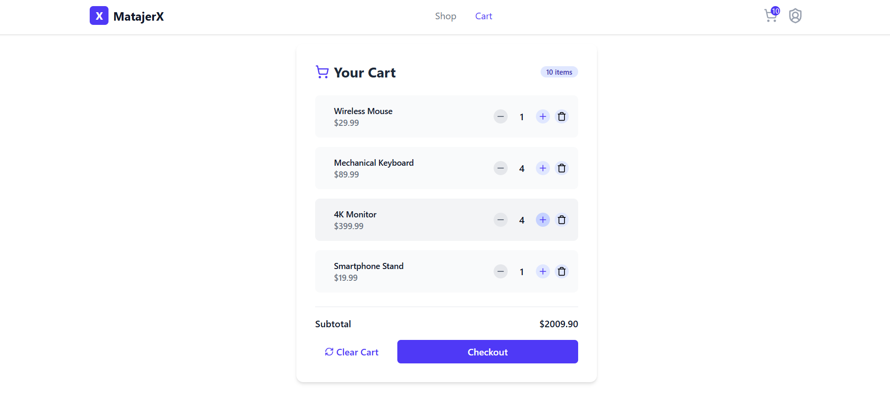

# MatajerX mini shop app

MatajerX is a React-based mini shopfront that includes the functionality to order products and an admin page to manage the products displayed within the store. It emphasizes creating modular components, efficient state management, and intuitive user friendly interface.

## Features & Technical Highlights

- **React Component Architecture** - Modular, reusable components built with functional React
- **State Management** - Efficient state handling using React Hooks (useState, useEffect)
- **API Integration** - Asynchronous data fetching with Axios
- **Modern UI Design** - Clean, intuitive interface built with Tailwind CSS
- **Pagination** - Smooth navigation through product listings
- **Product Browsing & Filtering** - Browse products with category filtering and search functionality
- **Real-time Data Handling** - Dynamic content updates through RESTful API integration
- **Admin Dashboard** - Complete product and category management for store administrators

## Screenshots




## Prerequisites

- Node.js and npm installed
- JSON Server (for local API development)

## Getting Started

1. Clone the repository:
   ```bash
   git clone https://github.com/Pog-Frog/Matajerx.git
   ```

2. Navigate to the project directory:
   ```bash
   cd Matajerx
   ```

3. Install dependencies:
   ```bash
   npm install
   `````

4. Run the development server:
   ```bash
   npm run dev
   ```

5. Access the application:
   - Main store: `http://localhost:5173`
   - Admin dashboard: `http://localhost:5173/admin`
